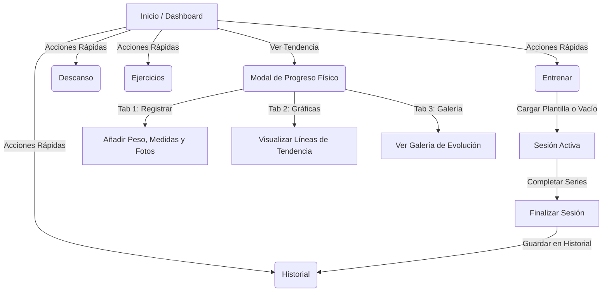

# 🏋️‍♂️ Workout App - Fitness & Progress Tracker

¡Bienvenido a **Workout App**, una aplicación móvil híbrida premium de fitness desarrollada con **React Native** y **Expo**! 

La aplicación combina un diseño visual impactante en *Dark Mode* con luces de neón (*glowing aesthetics*) y una arquitectura robusta basada en estados reactivos globales y persistencia local de datos. Permite a los atletas registrar entrenamientos utilizando plantillas de rutinas típicas, realizar un seguimiento de su descanso y monitorear su evolución corporal mediante gráficos dinámicos y una galería de fotos.

---

## 🚀 1. Pasos para Ejecutar o Probar el Proyecto

Sigue estos sencillos pasos para iniciar y probar la aplicación en tu entorno de desarrollo local:

### Requisitos Previos
* Tener instalado **Node.js** (versión 18 o superior recomendada).
* Tener instalado un gestor de paquetes como **npm** (incluido con Node.js) o **yarn**.

### Paso 1: Clonar e instalar dependencias
Abre la consola en el directorio raíz del proyecto y ejecuta:
```bash
npm install
```
*Este comando instalará todas las dependencias del proyecto, incluyendo Expo, React Navigation y los iconos de vector.*

### Paso 2: Iniciar el Servidor de Desarrollo (Metro Bundler)
Ejecuta el siguiente comando para arrancar Expo CLI:
```bash
npx expo start
```
O de forma alternativa para abrir directamente en plataformas específicas:
* **Entorno Web (Recomendado para pruebas rápidas):**
  ```bash
  npm run web
  ```
* **Dispositivo Físico o Simulador Android:**
  ```bash
  npm run android
  ```
* **Simulador iOS:**
  ```bash
  npm run ios
  ```

### Paso 3: Interactuar con la aplicación
* **En la Web:** Metro compilará el bundle y abrirá automáticamente la aplicación en tu navegador predeterminado (usualmente en `http://localhost:8081`).
* **En el Móvil:** Descarga la app **Expo Go** (disponible gratis en Google Play y App Store), escanea el código QR que se muestra en tu terminal de comandos y la aplicación se cargará instantáneamente en tu teléfono.

---

## 🏛️ 2. Arquitectura del Sistema

El proyecto está diseñado bajo un modelo arquitectónico desacoplado, modular y altamente eficiente para aplicaciones móviles, estructurado de la siguiente forma:

### Estructura de Directorios Clave
```text
workout_app/
├── app/                      # Sistema de Enrutamiento (Expo Router)
│   ├── (tabs)/               # Pestañas principales de la barra inferior
│   │   ├── index.tsx         # Inicio / Dashboard principal
│   │   ├── train.tsx         # Sección Entrenar (Sesión activa y Rutinas)
│   │   ├── history.tsx       # Historial de sesiones de entrenamiento
│   │   ├── rest.tsx          # Temporizador de Descanso
│   │   └── exercises.tsx     # Biblioteca de Ejercicios
│   └── _layout.tsx           # Configuración de navegación y carga de fuentes
├── constants/                # Tokens y configuraciones de diseño
│   ├── Colors.ts             # Paleta de colores Dark Theme (Primary, Accent, Surface)
│   └── MockData.ts           # Ejercicios simulados y datos semilla de usuario
├── context/                  # Capa de Negocio y Estado Global
│   └── WorkoutContext.tsx    # Orquestador del estado de entrenamientos y progreso físico
├── package.json              # Manifiesto de dependencias y scripts npm
└── README.md                 # Documentación del sistema
```

### Flujo de Datos y Gestión del Estado (Reactiveness)
El motor de la aplicación es el **`WorkoutContext`**, el cual administra el estado global mediante un patrón centralizado **Reducer** (`useReducer`):

1. **Estado Centralizado:** Almacena la sesión activa, el historial de entrenamientos y el registro histórico del progreso físico del usuario.
2. **Persistencia Síncrona:** Utiliza envoltorios reactivos alrededor de `localStorage` (en Web) y estructurado para ser fácilmente migrado a `AsyncStorage` (en iOS/Android). Cada acción que altera el historial o progreso físico activa un guardado automático inmediato.
3. **Acciones Declarativas:** Todas las modificaciones (añadir series, completar repeticiones, registrar peso, iniciar descanso) se despachan a través de acciones fuertemente tipadas, lo que asegura que cualquier pantalla reaccione en tiempo real sin desfases visuales.

---

## 👤 3. Flujo Principal de la Aplicación (Usabilidad)

La aplicación ofrece un flujo continuo donde cada sección está interconectada de manera lógica para maximizar la experiencia del usuario (UX):



### Recorrido Paso a Paso del Usuario

#### A. Dashboard Principal (Inicio)
Es la central de inteligencia. Al ingresar, el usuario ve una síntesis dinámica de su rendimiento:
* **Estado del Temporizador:** Si hay un descanso corriendo, se muestra la cuenta regresiva en vivo en la tarjeta "Descanso" con un borde neón parpadeante.
* **Sesión en Curso:** Si hay un entrenamiento activo, la tarjeta "Entrenar" advierte los ejercicios en curso y late en color verde para invitar al usuario a retomar.
* **Tarjeta de Progreso:** Muestra una vista previa del último registro físico (peso y medidas) junto a una etiqueta con la tendencia de peso perdida/ganada.
* **Interconexión:** Al presionar cualquiera de estas tarjetas, el usuario es redirigido mediante transiciones suaves directamente a esa sección.

#### B. Flujo de Entrenamiento (Entrenar ➔ Historial)
1. **Comenzar:** En "Entrenar", el usuario puede elegir **Entrenamiento Libre** para empezar de cero, o seleccionar una plantilla (**Torso, Pierna, Push, Pull, Full Body**).
2. **Sesión Activa:** Al cargar una plantilla, se despliegan los ejercicios con sus series pre-llenadas. El usuario puede cambiar los kilogramos y repeticiones directamente en cada casilla.
3. **Completado Activo:** Tocar el botón de check de una serie la ilumina en verde neón, aumentando los contadores de volumen y racha. El usuario puede añadir nuevas series o ejercicios.
4. **Finalizar:** Al presionar **Terminar**, se despliega el resumen estadístico con volumen total, ejercicios y series realizadas. Al pulsar **Guardar**, el entrenamiento se almacena instantáneamente en el Historial global y la pantalla de Entrenar vuelve a quedar disponible.
5. **Historial:** En la pestaña "Historial", aparece la nueva sesión completada bajo el nombre específico de la plantilla (ej: *Rutina: Torso*). Pulsar en ella abre una hoja de detalles interactiva.

#### C. Control de Recuperación (Descanso)
* El usuario puede entrar directamente para configurar un temporizador rápido (30s, 60s, 90s, etc.) o un tiempo personalizado.
* El reloj funciona en segundo plano dentro de la app, actualizando dinámicamente las tarjetas y el dashboard.

#### D. Control del Progreso Físico (Progreso)
* Al hacer clic en la tarjeta **Progreso** en la pantalla de Inicio, se abre una hoja modal deslizable:
  1. **Registrar:** Permite anotar las métricas del día (Peso, Cintura, Pecho, Cadera) y seleccionar una silueta estilizada o subir una foto real.
  2. **Gráficas:** Muestra gráficos interactivos con líneas de evolución, escalando automáticamente para revelar estadísticas de valores Mínimos, Máximos y Variación real de peso y medidas.
  3. **Fotos:** Presenta una grilla ordenada por fecha que recopila la evolución visual del cuerpo con badges de peso incorporados.
